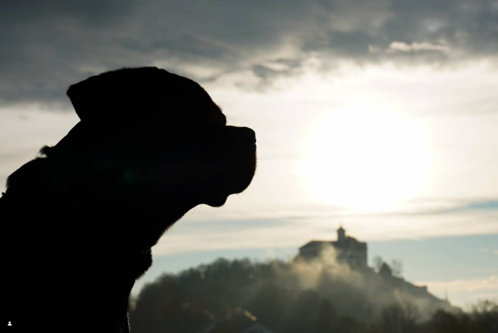

# Überschrift 1
Überschrift

## Überschrift 2
...

### Überschrift 3
...

## Foto
Bild 1  
   
  
Bild funktioniert  
  

    
[Insta](https://www.instagram.com/rottweilervomvaihingerschloss/)








Bild 
  

Bild 3  
  